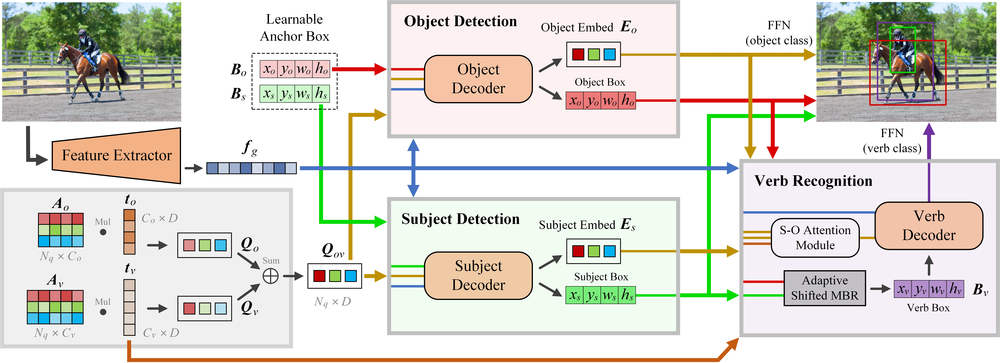

# SOV-STG

Focusing on what to decode and what to train: Efficient Training with HOI Split Decoders and Specific Target Guided DeNoising ([paper](https://arxiv.org/abs/2307.02291))



## Requirements

- PyTorch >= 1.8.1
- torchvision >= 0.9.1
- loguru (log training process and env info)
  - tabulate (format log info)

```bash
pip install -r requirements.txt
```

- Compiling CUDA operators

```bash
cd ./models/dn_dab_deformable_detr/ops
sh ./make.sh
# test
python test.py
```

## Dataset Preparation

### HICO-DET

Please follow the HICO-DET dataset preparation of [GGNet](https://github.com/SherlockHolmes221/GGNet). See the README.md of [QAHOI](https://github.com/cjw2021/QAHOI).

After preparation, the `data/hico_det` folder as follows:

```bash
data
├── hico_det
|   ├── images
|   |   ├── test2015
|   |   └── train2015
|   └── annotations
|       ├── anno_list.json
|       ├── corre_hico.npy
|       ├── file_name_to_obj_cat.json
|       ├── hoi_id_to_num.json
|       ├── hoi_list_new.json
|       ├── test_hico.json
|       └── trainval_hico.json
|       
```

### V-COCO

Please follow the installation of [V-COCO](https://github.com/s-gupta/v-coco).

For evaluation, please put `vcoco_test.ids` and `vcoco_test.json` into `data/v-coco/data` folder.

After preparation, the `data/v-coco` folder as follows:

```bash
data
├── v-coco
|   ├── prior.pickle
|   ├── images
|   |   ├── train2014
|   |   └── val2014
|   ├── data
|   |   ├── instances_vcoco_all_2014.json
|   |   ├── vcoco_test.ids
|   |   └── vcoco_test.json
|   └── annotations
|       ├── corre_vcoco.npy
|       ├── test_vcoco.json
|       └── trainval_vcoco.json
```

## Evaluation

Download the model to `params` folder.
- We test the model with NVIDIA A6000 GPU, Pytorch 1.8.1, Python 3.8 and CUDA 11.2.

### HICO-DET

| Model | Full (def) | Rare (def) | None-Rare (def) | Full (ko) | Rare (ko) | None-Rare (ko) | ckpt |
|:---:|:---:|:---:|:---:|:---:|:---:|:---:|:---:|
| SOV-STG-S | 33.80 | 29.28 | 35.15 | 36.22 | 30.99 | 37.78 | [checkpoint](https://drive.google.com/file/d/1cvjcUS-vKISrwNS8H4YAuQu45vUXqU09/view?usp=sharing) |
| SOV-STG-Swin-L (scratch) | 40.49 | 39.47 | 40.80 | 42.56 | 41.24 | 42.95 | [checkpoint](https://drive.google.com/file/d/1efjV5QCZp3ytuzaHTIWdWpEJnKk4TwDa/view?usp=sharing) |
| SOV-STG-Swin-L | 43.35 | 42.25 | 43.69 | 45.53 | 43.62 | 46.11 | [checkpoint](https://drive.google.com/file/d/1D7BEAAzHggoRZMGlChJiynOQbiXqwgRI/view?usp=sharing) |

### V-COCO

| Model | AP (S1) | AP (S2) | ckpt |
|:---:|:---:|:---:|:---:|
| SOV-STG-L | 63.9 | 65.4 | [checkpoint](https://drive.google.com/file/d/1ye_vJWopP1v9VxKYUmP4TI4AsQvX4IC_/view?usp=sharing) |

Evaluating the model by running the following command.

```bash
# SOV-STG-S (HICO-DET)
sh configs/sov-stg-s_eval.sh

# SOV-STG-Swin-L_scratch (HICO-DET)
sh configs/sov-stg-swin-l_scratch_eval.sh

# SOV-STG-Swin-L (HICO-DET)
sh configs/sov-stg-swin-l_eval.sh

# SOV-STG-L (V-COCO)
sh configs/vcoco_sov-stg-l_eval.sh
```

## Training

### HICO-DET
- Training SOV-STG with Swin-Large.

Download our pre-trained DN-Deformable-DETR swin-Large model from [Google Drive](https://drive.google.com/file/d/1P_hTb5lhs9ImuAwS5ar56Gf8bgvYa3Z0/view?usp=sharing) to `params` folder.


```bash
# paramter convert (optional)
python convert_parameters.py \
    --load_path params/dn_dab_deformable_detr_swin_large.pth \
    --save_path params/sov-stg-swin-l_hico.pth

# train from scratch
sh configs/sov-stg-swin-l_scratch.sh

# train from pre-trained DN-Deformable-DETR Swin-Large
sh configs/sov-stg-swin-l.sh
```

- Training SOV-STG-S

Download the official pre-trained DN-Deformable-DETR R50 model from [Google Drive](https://drive.google.com/drive/folders/1pIllR0VfSIqX8TmQy0PFNiPdp87j-78j?usp=sharing) or [BaiDu](https://pan.baidu.com/s/1ugoXlpr3x72qcXPKQ669sA?pwd=niet) to `params` folder.

```bash
# paramter convert (optional)
python convert_parameters.py \
    --save_path params/sov-stg-s_hico.pth

sh configs/sov-stg-s.sh
```

### V-COCO

Download our pre-trained DN-Deformable-DETR R101 model from [Google Drive](https://drive.google.com/file/d/1nsWxibFeNj7gENzFzB620a6JbX_ln8ww/view?usp=sharing) to `params` folder.
- Train SOV-STG-L

```bash
# paramter convert
python convert_parameters.py \
    --dataset vcoco \
    --save_path params/sov-stg-l_vcoco.pth

# train
sh configs/vcoco_sov-stg-l.sh
```

## Citation
```
@article{chen2023focusing,
  title={Focusing on what to decode and what to train: Efficient Training with HOI Split Decoders and Specific Target Guided DeNoising},
  author={Chen, Junwen and Wang, Yingcheng and Yanai, Keiji},
  journal={arXiv preprint arXiv:2307.02291},
  year={2023}
}
```